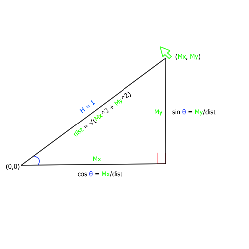

# GodotCircularMovement
---
This is a small demo on the Godot game engine to convert mouse coordinates into a circular movement for a sprite to follow relative to another node's position.

---

The process is simple and involves very basic trigonometry.  
The first step was to offset the usual coordinate system for another where the center (0,0) was the sprite's center. The coordinates of mouse M relative to the node N where simply defined as (Mx-Nx, Ny-My).   
  
Now, for the second part, the sprite is supposed to have the same coordinates as the mouse but converted to a unit circle. This is simple since computing the sine and cosine for the mouse coordinates already does that. In order to get the hypotenuse required in these formulas, I simply used the distance formula or more specifically in that case a direct application of pythagora's theorem because we measure it from the center at (0, 0).

  
_In green, the mouse coordinates (with offset to center) and in blue, the coordinates converted to the unit circle_  
## Result

_[GIF of demo]_
[Sprites credit](https://helianthus-games.itch.io/pixel-art-planets)
### Notes
I tried to be more concise in this explanation because there is no point in going into details because I probably don't know enough to do so and it's longer to make as well.
